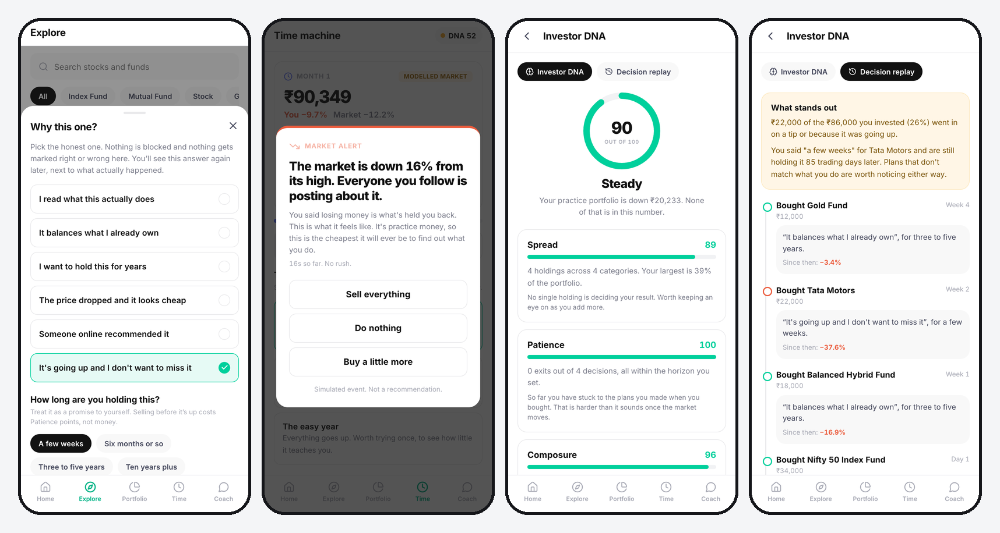

# Groww Practice Mode

A practice investing account for 20 to 26 year olds that scores how you decide, not what you made.

Prototype for the Groww product internship assignment. Not affiliated with Groww.

**Live:** https://groww-practice-mode.vercel.app



## Try it

Open [groww-practice-mode.vercel.app](https://groww-practice-mode.vercel.app) on a phone, or on desktop where the phone sits beside a short description. To see the crash alert, invest in two things, then go to Time and start the year.

## The idea

Most simulators score returns, and over a few months returns are mostly luck. In this prototype's easy year, going all-in on Tata Motors because it was rising makes 40.8%, and a spread of funds with reasons makes 20.3%. Investor DNA scores them 26 and 70.

- **Every purchase asks why**, and for how long. Nothing is judged at that point.
- **The market falls on purpose.** The app stops at a 12% fall, and records what you do and how long you take.
- **Investor DNA** rates spread, patience, composure and conviction. Profit isn't in it.
- **The replay** shows what you said next to what happened.
- **It ends in a real SIP** from ₹100 a month, built from the funds you practised with and sized from a short salary plan.

## Documents

| | |
| --- | --- |
| [Case study](docs/01-case-study.md) | The one-pager: problem, scope, solution and why |
| [Prompt log](docs/02-prompt-log.md) | The prompts used to build it, and what each round changed |
| [Evals](docs/03-evals.md) | What was tested and the real results, including the weak ones |
| [Strategy note](docs/04-strategy-note.md) | Segmentation, metrics, risks and rollout |

## Run it

```bash
npm install
npm run dev           # http://localhost:5173
npm run test:engine   # 91 checks on the market model, scoring, SIP split and coach
npm run build
```

React, TypeScript and Vite. No backend, no chart library: charts are SVG, and state lives in the browser.

```
src/data/instruments.ts   nine instruments, each with a one-line description and its catch
src/lib/market.ts         deterministic modelled years, with price history before day one
src/lib/dna.ts            the portfolio snapshot, the four traits and the graduation checks
src/lib/history.ts        replays the trade log into the portfolio-vs-market chart
src/lib/coach.ts          ordered intent rules; refusals are checked before answers
src/lib/sip.ts            splits a real SIP so every fund gets at least ₹100
test/                     engine checks, market stories and the coach prompt sets
```

All prices and market movements are simulated. The years are shaped like real Indian market years, but they aren't replays of them. Nothing here is investment advice, and no real transaction is possible.
